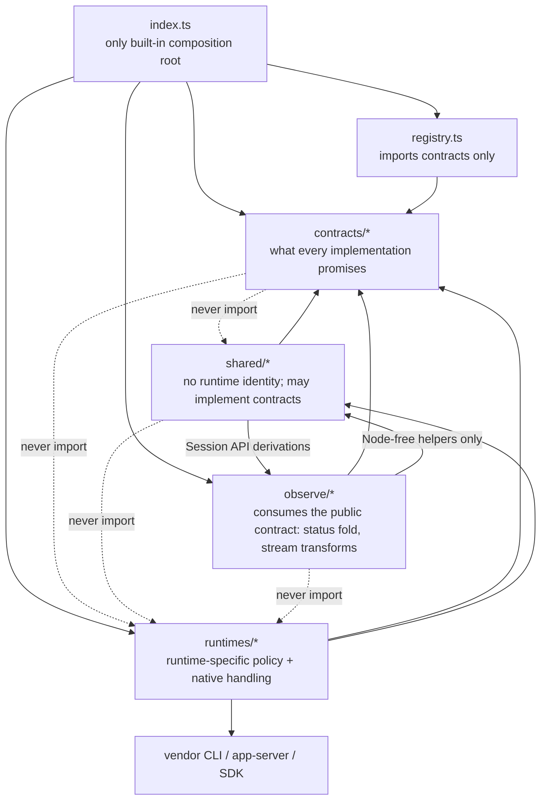

# Source layout

For each runtime's native programming interface and its current mapping to
these contracts, see [`docs/runtimes/`](../../../docs/runtimes/README.md).

```text
src/
  index.ts                 # public exports + built-in composition
  registry.ts              # runtime collection and lookup
  voyage.ts                # oar-voyage/3 evidence log: line builders + recorder
  brands.ts                # @botiverse/oar/brands: browser-safe names and icons
  kernel.ts                # @botiverse/oar/kernel: the runtime-author SPI
  contracts/               # provider-independent agreements
  runtimes/<id>/           # one runtime, split by capability
  community/<id>/          # a contributor-maintained runtime, exported from @botiverse/oar/community, not in the built-in registry
  shared/                  # mechanisms + shared contract implementations
  observe/                 # consumer-side derivations over the record stream (events.ts: eventsOf + coalesceText behind Session.events(); status fold, turn helpers, usage folds, conversation and session view)
  agents/                  # @botiverse/oar/agents: subagents over a runtime registry (built-in by default)
  testing/                 # @botiverse/oar/testing: scriptedRuntime on the kernel SPI
```



- Simple capabilities use one behavior contract; add separate API/SPI contracts only when abstraction level or call direction differs. Say "runtime X passed the behavior tests", not "conformance": one word, no ceremony.
- `runtimes/<id>/index.ts` declares that runtime's supported capabilities. Keep its parsing, compatibility policy, and protocol details nearby.
- Keep host dependencies as constructor inputs until multiple runtimes prove a stable shared boundary. Do not create empty architecture directories.
- Test layers (`tests/`, `sea-trial/`, `experiments/`) are described in [`docs/development.md`](../../../docs/development.md#how-to-validate-the-changes).
- Installation probing is local-only. Account usage is a separate authenticated observation capability.
- Behavior invariants live as comments on the exact contract member they constrain; every must/never has (or gets) a sea-trial case.
- The agent-facing dependency direction is discovery/capabilities → control →
  records → observe → continue. Keep host policy and persistence outside the
  package; see [`docs/design/system.md`](../../../docs/design/system.md).
